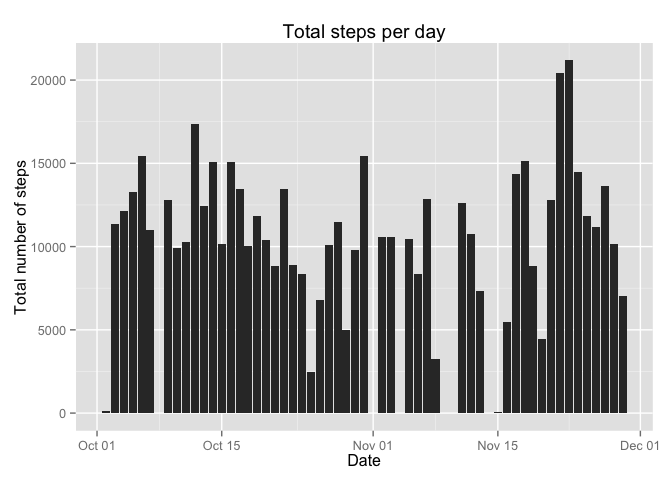
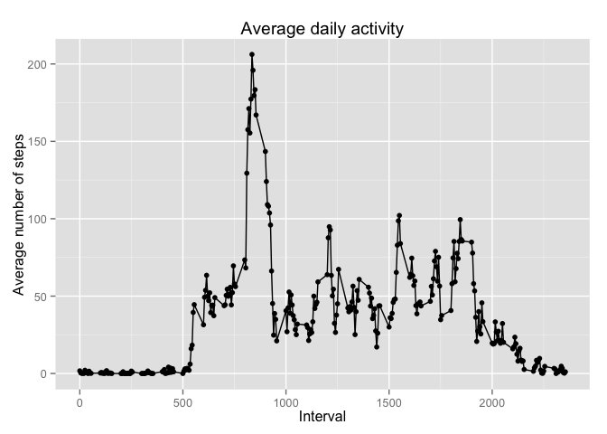
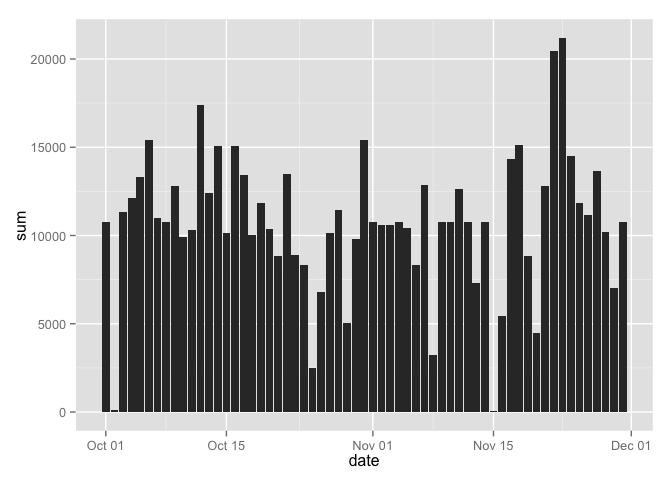
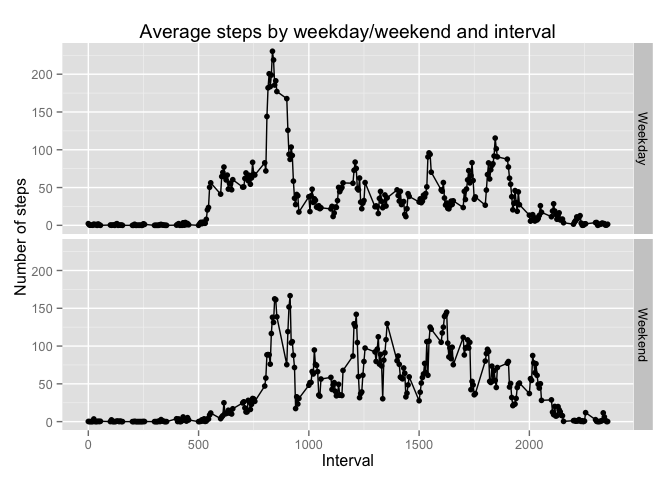

# Reproducible Research: Peer Assessment 1


## Loading and preprocessing the data
The data we are using for this assessment comes from forking this repository http://github.com/rdpeng/RepData_PeerAssessment1. The data was contained the zip file 'activity.zip' after unzipping it and placing it in our working directory we loaded the data into our environment and converted the data column into a date class.

```r
data<-read.csv('activity.csv')
data$date<-as.Date(data$date, format="%Y-%m-%d")
```


## What is mean total number of steps taken per day?
What I noticed at first was that there are many NA values in our dataset. Many of our statistical tools will not work when they are presented with the NA values. As such I decided that the first step would be to remove the NA values from our dataset.

```r
data.p1<-data[!is.na(data$steps),c(1,2)]
```
In addition to removing the NA values, I also removed the interval column in the dataset. Presently we are interested in the number of STEPS PER DAY, so the interval column is not really needed at this point.  

Next I calculated the total number of steps taken each day and placed it into its own data frame.

```r
data.p1<-tapply(data.p1$steps, data.p1$date, sum)
data.p1<-as.data.frame(data.p1)
data.p1$date<-as.Date(rownames(data.p1))
colnames(data.p1)<-c('sum', 'date')
```
Using this I then constructed a histogram of total number of steps against for each date.

```r
library(ggplot2)
ggplot(data.p1, aes(x=date,y=sum)) + geom_histogram(stat='identity') + labs(title = "Total steps per day", x = "Date", y = "Total number of steps")
```

 

From this data i also calculated the mean and median of the total daily steps over all days.

```r
mean(data.p1$sum)
```

```
## [1] 10766.19
```

```r
median(data.p1$sum)
```

```
## [1] 10765
```

## What is the average daily activity pattern?
This time I wanted to look at the average number of steps by interval aross all days.
To do this I first removed the date column from our orignal dataset and by calculating the mean for each interval.

```r
data.p2<-data[!is.na(data$steps),c(1,3)]
data.p2<-tapply(data.p2$steps, data.p2$interval, mean)
data.p2<-as.data.frame(data.p2)
data.p2$date<-as.integer(rownames(data.p2))
colnames(data.p2)<-c('mean','interval')
```

Using this data I constructed a line graph plotting the mean number of steps against the each interval.

```r
library(ggplot2)
ggplot(data.p2, aes(x=interval,y=mean)) + geom_line() + geom_point() + labs(title = "Average daily activity", x = "Interval", y = "Average number of steps")
```

 

Additionally I calulated the interval with the maximum average number of steps.

```r
data.p2$mean<-as.numeric(data.p2$mean)
data.p2[which.max(data.p2[,1]),2]
```

```
## [1] 835
```

## Imputing missing values
As I mentioned earlier our data contained a fair bit of NAs, specifically it contained __ amount of NAs

```r
sum(is.na(data$steps))
```

```
## [1] 2304
```

Because simply removing the NAs induced a fair bit of bias into our investigation I decided to instead use the mean for that interval in place of the NA. To do this I had to reconstruct the data to replace the NAs with the interval mean.


```r
#calculate the mean of each interval
data.p3<-data[!is.na(data$steps),c(1,3)]
data.p3<-tapply(data.p3$steps, data.p3$interval, mean)
data.p3<-as.data.frame(data.p3)
data.p3$date<-as.integer(rownames(data.p3))
colnames(data.p3)<-c('mean','interval')

#seperate data into NA rows and non-NA rows
data.NA<-data[is.na(data$steps),]
data.nonNA<-data[!is.na(data$steps),]

#replace steps with in NA data with the mean of each interval
data.NA<-merge(x=data.NA, y=data.p3, by='interval', all.x=TRUE)
data.NA<-data.NA[,c(1,4,3)]
colnames(data.NA)<-c('interval','steps','date')

#recombine to make a whole dataset
data.comb<-rbind(data.nonNA,data.NA)
```

Using this new dataset I reconstructed the histogram from earlier.

```r
#calculate sums of each day
data.p4<-tapply(data.comb$steps, data.comb$date, sum)
data.p4<-as.data.frame(data.p4)
data.p4$date<-as.Date(rownames(data.p4))
colnames(data.p4)<-c('sum', 'date')

#create histogram
library(ggplot2)
ggplot(data.p4, aes(x=date,y=sum)) + geom_histogram(stat='identity')
```

 

Also the new mean and median

```r
#calculate the mean and median
mean(data.p4$sum)
```

```
## [1] 10766.19
```

```r
median(data.p4$sum)
```

```
## [1] 10766.19
```

By filling in the NA values, our mean remains unchanged and a median rises slightly.
## Are there differences in activity patterns between weekdays and weekends?
To do this I had to first create a seperate column with a weekday or weekend flag.

```r
data.comb$day<-ifelse(weekdays(data.comb$date) %in% 
                    c('Monday', 'Tuesday', 'Wednesday', 'Thursday', 'Friday'),
                    'Weekday',
                    'Weekend')
```

Next I reconstructed the data to calculate the average steps across each interval and weekday/weekend status.

```r
#split into weekday and weekend
data.comb.day<-subset(data.comb,day=='Weekday')
data.comb.end<-subset(data.comb,day=='Weekend')

#calculate the mean of each interval
data.p5.day<-as.data.frame(tapply(data.comb.day$steps, data.comb.day$interval, mean))
data.p5.day$date<-as.integer(rownames(data.p5.day))
colnames(data.p5.day)<-c('mean','interval')
data.p5.day$day<-'Weekday'

data.p5.end<-as.data.frame(tapply(data.comb.end$steps, data.comb.end$interval, mean))
data.p5.end$date<-as.integer(rownames(data.p5.end))
colnames(data.p5.end)<-c('mean','interval')
data.p5.end$day<-'Weekend'

#recombine to make a full dataset
data.p5<-rbind(data.p5.day, data.p5.end)
```

Finally I created a plot side by side plot of the line graphs of the mean against the interval.

```r
library(ggplot2)
ggplot(data.p5, aes(x=interval,y=mean)) + facet_grid(day ~ .) + geom_line() + geom_point() + labs(title="Average steps by weekday/weekend and interval", x = "Interval", y="Number of steps")
```

 
